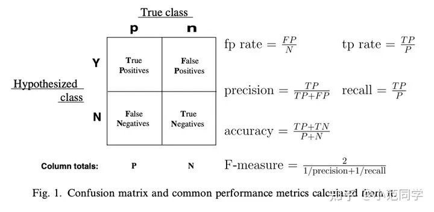

# 生物信息计算大作业

## 工作流程

在主文件`main.py`启动
1. 从`load_data.py`中加载数据集
2. 使用的模型保存在`model.py`中
3. 把数据集和需要使用的模型传入训练器`Trainer`类中开始训练

## 模型建立

在给定的数据中，由于负样本的数量远大于正样本，如果在训练时一起传入，会导致模型无法识别出正样本。
因此需要调整正负样本的比例，我这里使用正负样本1:2的比例设置训练集。

## 评价指标

### AUROC

ROC曲线
- 横轴是FPR（负类样本中被判定为正类的比例)
- 纵轴是TPR（recall）（正类样本中被判定为正类的样本）

AUC 最普遍的定义是ROC曲线与坐标轴形成的面积，取值范围 [0, 1]。

但其实另一种定义更常用，分别随机从正负样本集中抽取一个正样本，一个负样本，正样本的预测值大于负样本的概率。

**意义**：当AUC接近1时，表示模型具有很好的区分能力，能够有效地将正例和负例区分开来。而当AUC接近0.5时，表示模型的分类能力较差，无法区分正例和负例。

### AUPR

PR曲线
- 横轴是召回率（Recall）查全率（TPR）。即正确预测为正的占全部实际为正的比例
- 纵轴是精确率（Precision）查准率、灵敏性（Sensitivity）。即正确预测为正的占全部预测为正的比例

**意义**：当AUPR接近1时，表示模型具有很好的分类性能，能够有效地检测到正例，并保证较低的误检率。而当AUPR接近0时，表示模型的分类能力较差。

### F1-score

F1-score是综合考虑了模型的精确率（Precision）和召回率（Recall）的指标，它是精确率和召回率的调和平均数。

**意义**：F1 分数越接近 1，表示模型的性能越好，精确率和召回率的平衡性越高。而当 F1 分数接近 0 时，表示模型的性能较差，精确率和召回率之间的平衡性较低。
